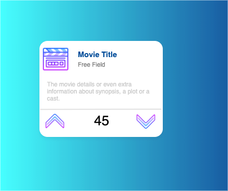

After having our own html, css setup from [Figma UIUX class ](https://www.figma.com/file/sW8aM7yjCGqxB6V3tvn7fw/Homework?node-id=0%3A1)

We are going to reuse this design to have a "Like/Dislike | Recommend/Not Recommend | Love/Hate" my Movies app

---
<!-- TOC -->

- [:movie_camera: Result](#moviecamera-result)
- [Usage](#usage)
- [The Movie Database API](#the-movie-database-api)
- [Some Examples](#some-examples)
  - [Discover Movies](#discover-movies)
  - [Movie Details](#movie-details)
  - [Trending Movies](#trending-movies)
- [Not Extras, but required (MUST)](#not-extras-but-required-must)
- [You already now how to deliever it ;)](#you-already-now-how-to-deliever-it)

<!-- /TOC -->


# :movie_camera: Result

The app will look like this:



- You will display the movie poster as an icon. (`poster_path` field)
- Movie Title (`original_title` field)
- Free Field (choose wisely the field you wish to display)
- The movie plot/synopsis (`overview`)
- Two vote buttons (UP/DOWN) which will increase/decrease the vote_count
- Vote Count which will initialize at `vote_count`
- Feel free to modify the layout to add anything you want. some suggested fields to display:
  - vote_average
  - runtime
  - genres
  - homepage
  - imdb_id (prob generate an IMDb link)
  - popularity


> here only one box is shown, obviously you will work with a variable list of movies.

# Usage

> Fill this with your instructions on how to run your app.

```bash
# ERROR WHEN RUNNING IN DOCKER
docker run -it -p 5000:5000 love-my-movies-test

# RUN USING PYTHON 
# run myMoviesApp.py

```

# The Movie Database API
We are going to use The Movie Database API 3 [TMDd](https://www.themoviedb.org/) to retrieve our initial data.

You better create your own account and respect the request limits, that I why I'm including some `.json` files already.

This is the [API's full URL](https://developers.themoviedb.org/3)

# Some Examples

## [Discover Movies](https://developers.themoviedb.org/3/discover/movie-discover)

The Request URL was

```bash
https://api.themoviedb.org/3/discover/movie?api_key=<<api_key>>&language=en-US&sort_by=popularity.desc&include_adult=false&include_video=false&page=1
```

> I replaced <<api_key>> with my own API_KEY

Which resulted in [discover_movies.json](discover_movies.json)

## [Movie Details](https://developers.themoviedb.org/3/movies/get-movie-details)

The Request URL was

```bash
https://api.themoviedb.org/3/movie/475557?api_key=<<api_key>>
```

Which gave me [joker_movie_details.json](joker_movie_details.json)

## [Trending Movies](https://developers.themoviedb.org/3/trending/get-trending)

Request URL was
```bash
https://api.themoviedb.org/3/trending/movie/week?api_key=<api_key>>
```

Which gave me [trending_movies.json](trending_movies.json)


# Not Extras, but required (MUST)

- [ ] Use Flask as backend (for now)
- [ ] Use Redis as the counter DB (incr/decr vote_count)
- [ ] Use Redis to store any details or additional info for the movies (JSON respond)
- [ ] Use Redis as a cache.
- [ ] CI/CD (you can use GithubActions (beta) / Gitlab CI /Travis/ Circle CI)
- [ ] Dockerfile with a valid docker build & push to a valid Docker Hub repository.
- [ ] A good html/css layout of your own.
- [ ] Modularize everything with files and functions.
- [ ] Use javascript to "Click and show more details of the movie"
- [ ] IT WILL NOT RUN under python, but Docker, you must provide under the [README's Usage](#usage) how to run it using Docker commands


# You already now how to deliever it ;)
- FORK it
- WORK it
- GIT TAG it
- DELIVER it